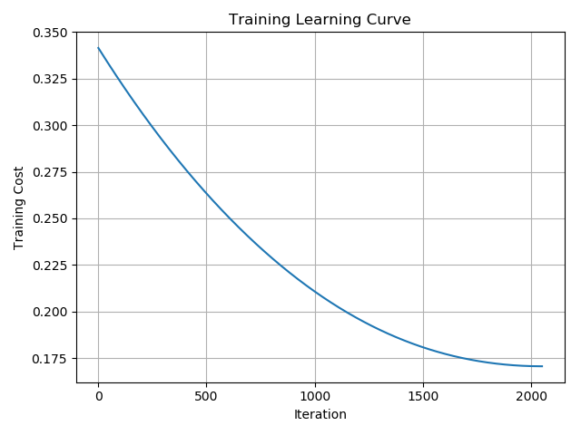

Logistic Regression for the Wisconsin Breast Cancer Dataset:

https://archive.ics.uci.edu/ml/datasets/Breast+Cancer+Wisconsin+(Diagnostic)

## Training Learning Curve

## Accuracy Stats

Overall Accuracy: 0.928

| Class         | Labeled       | Predicted|
| ------------- |:-------------:| -------------:|
| Malignant     | 212           | 191           |
| Bening        | 357           | 378           |

| Class         | True Positive | False Positive|
| ------------- |:-------------:| -------------:|
| Malignant     | 183           | 8             |
| Bening        | 349           | 29            |

| Class         | Precision     | Recall| F1 Score |
| ------------- |:-------------:| -----:| --------:|
| Malignant     | 0.958         | 0.863 | 0.908    |
| Bening        | 0.923         | 0.978 | 0.950    |

